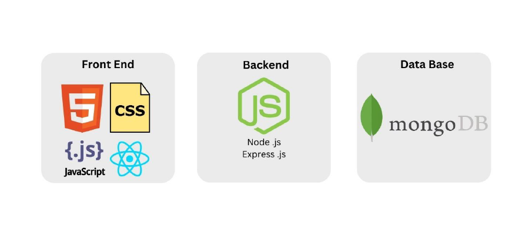

### BIT-Online-Course-Portal

The project idea is to create an online portal for students and instructors to interact, create task-based courses, enroll in courses, and have a great hands-on learning experience with standard validation techniques.

---

### Tech Stack

This project is built using the following technologies:

---

